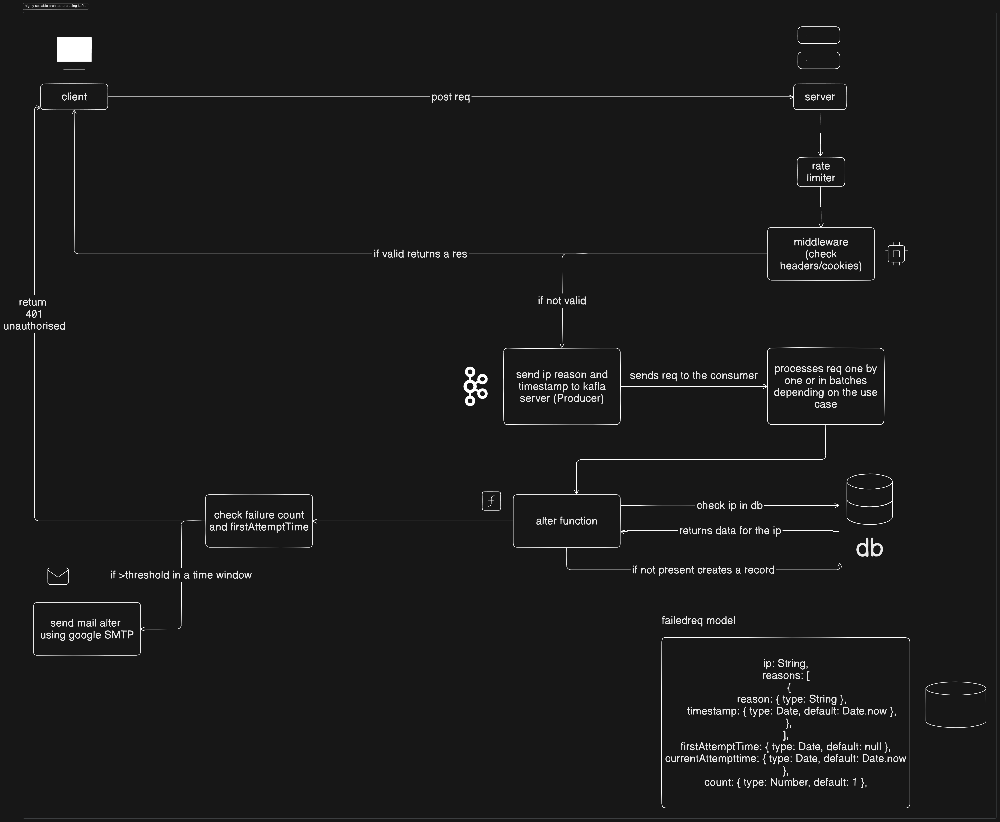

# FlexyPe Backend Assignment 🚀

This repository contains the implementation of the backend architecture for the **FlexyPe Assignment**. The project demonstrates the use of **Kafka** for handling failed requests and processing them efficiently.

---

## Table of Contents

- [Introduction](#introduction)
- [Architecture Overview](#architecture-overview)
- [Features](#features)
- [Prerequisites](#prerequisites)
- [Environment Variables](#environment-variables)
- [Installation](#installation)
- [Usage](#usage)
  - [Running the Producer](#running-the-producer)
  - [Running the Consumer](#running-the-consumer)
- [Kafka Setup](#kafka-setup)
  - [Using Aiven Kafka Cluster](#using-aiven-kafka-cluster)
- [Scripts](#scripts)
- [Contributing](#contributing)
- [License](#license)

---

## Introduction 🌟

The backend system is designed to handle failed requests from a client and log them into a **Kafka topic**. The architecture includes:

1. A **producer** that captures and sends failed requests to Kafka.
2. A **consumer** that processes these requests and updates the database accordingly.

This project showcases an asynchronous, efficient, and scalable solution for handling failed requests, with built-in support for monitoring and alerting.

---

## Architecture Overview 🏗️

The system is comprised of the following components:

- **Producer**: Captures failed requests and sends them to a Kafka topic.
- **Kafka**: Acts as the message broker, managing the failed request logs.
- **Consumer**: Consumes messages from the Kafka topic, processes them, and updates the database.
- **Database**: Stores information about failed requests and their details for alerting and monitoring.

> 

---

## Features ✨

- Captures and logs failed requests efficiently.
- Asynchronous request processing using **Kafka**.
- Database updates with failure details for alerting and monitoring.
- Rate limiting and alerting mechanisms for failed requests.

---

## Prerequisites ✅

Before running the project, ensure the following dependencies are installed:

- **Node.js** (v14 or higher)
- **Docker** & **Docker Compose**
- A **Kafka Cluster** (local setup or a cloud provider like Aiven)
- **MongoDB**

---

## Environment Variables 🔑

The application requires the following environment variables. You can set these in a `.env` file at the root of the project:

```plaintext
KAFKA_HOST=<Your Kafka Host>
KAFKA_USER=<Your Kafka Username>
KAFKA_PASSWORD=<Your Kafka Password>
MONGODB_URI=<Your MongoDB Connection String>
EMAIL_USER=<Your Email Username>
EMAIL_PASS=<Your Email Password>[app password]
```

## Installation

Clone the repository:

```bash
git clone https://github.com/SatyamMattoo/alert_service
cd alert_service
```

### Install dependencies:

```bash
npm install
```

#### Set up the .env file with your environment variables as described above along with the Kafka and MongoDB configuration.

Start the services using Docker Compose:

```bash
docker-compose up -d
```

## Usage

**Starting the Producer:** The producer captures failed requests and sends them to Kafka.
**Starting the Consumer:** The consumer listens to the Kafka topic and processes messages.

## Kafka Setup

To connect to your Kafka cluster (local or cloud-based), ensure the following (Avien Kafka Cluster is free and preferred):

You have access to the Kafka host, port, and credentials.
The SSL certificates (if required) are correctly set up in the project.
Using Aiven Kafka Cluster
For Aiven Kafka:

Download the CA certificate, client certificate, and client key from the Aiven console.
Place these files in a secure directory in your project in the `./certificates` directory.
Configure the paths to these certificates.

## Scripts

start: Starts the producer and consumer services.

## Contributing

Contributions are welcome! Please fork the repository and create a pull request with your changes.

## License

This project is licensed under the MIT License. See the LICENSE file for more details.
